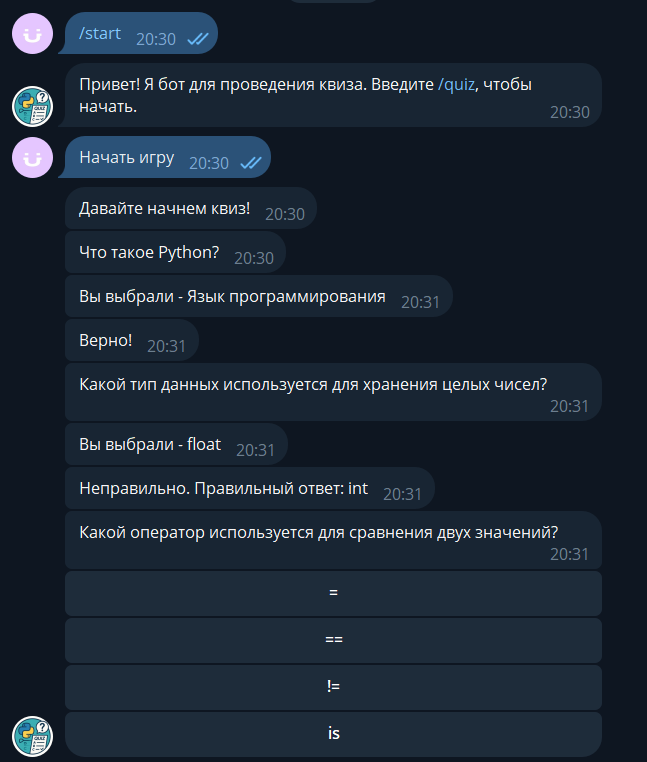

# QuizPythonBot - Асинхронный Telegram-бот на Python с использованием aiogram 3, реализующий квиз (викторину) с несколькими вопросами по  и подсчетом очков.

[Перейти к боту в Telegram](https://t.me/Quiz_thefounder_bot)

---

## 🚀 Основные возможности

- Выводит список вопросов с вариантами ответа (кнопки).
- Проверяет правильность ответа.  
- Считает баллы и показывает статистику.
- Хранит прогресс и результаты в базе данных.

---

## 🛠️ Технологии

- Python  
- aiogram — для создания Telegram-бота  
- dotenv
- aiosqlite

---
## 📁 Структура проекта
```text
project/
├── app/
│ ├── database/
│ │ └── table.py # Работа с SQLite
│ ├── handlers.py # Обработка сообщений и колбэков
│ ├── keyboards.py # Генерация клавиатур
│ └── quiz.py # Логика квиза и вопросы
├── .env # Токен бота
├── main.py # Точка входа
├── requirements.txt # Зависимости
└── README.md # Этот файл
```
---

## 📥 Установка и запуск

1. Клонируйте репозиторий:
```bash
git clone <URL_репозитория>
cd project
```

2. Создайте и активируйте виртуальное окружение:
```bash
python -m venv .venv
.venv\Scripts\activate
```
3. Установите зависимости:
```bash
pip install -r requirements.txt
```
4. Создайте файл .env
```bash
BOT_TOKEN=твой_токен_бота
```

5. Запустите бота:
```bash
python main.py
```

---
## Пример взаимодействия с ботом



---

## 📃 Лицензия
Проект распространяется под лицензией MIT.

